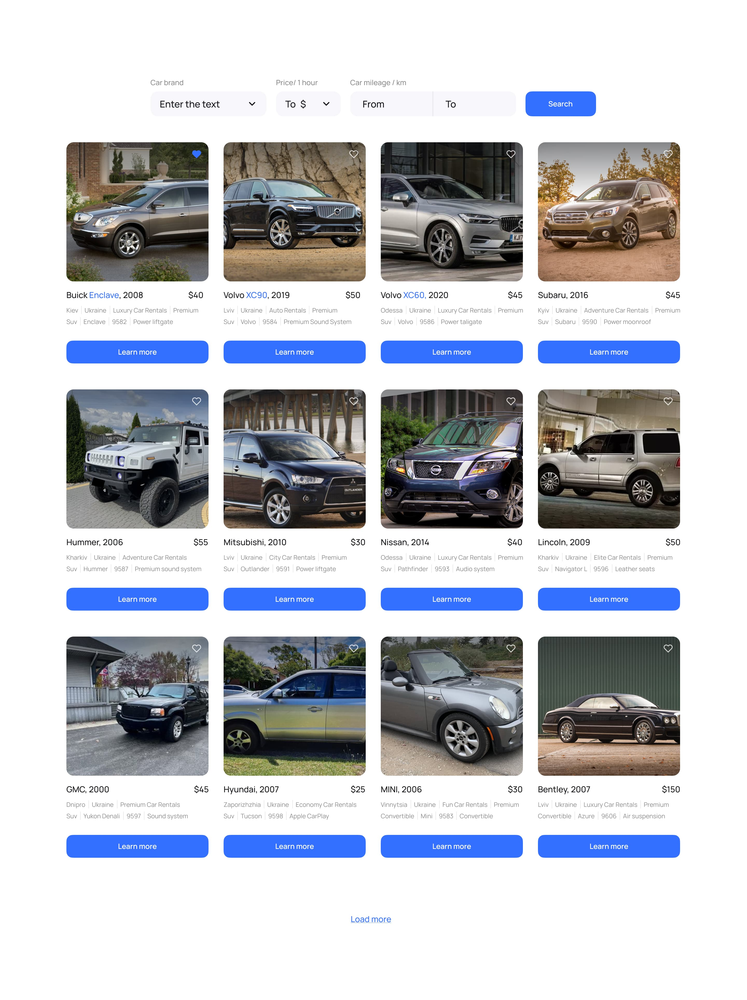

# Test task

## Description

Create an application for companies that provide car rental services in Ukraine
for rent The application consists of 3 pages:

- home page with a general description of the services provided by the company.
  Stylization and design at your discretion.
- a page containing a catalog of cars of various configurations that can be
  obtained by the user filter by brand, price per hour to rent a car and number
  of kilometers, which was overcome by the car during its operation (mileage).
- a page with ads that have been added by the user to Favorites External the
  application view should consist of caydbaru and viewport.

    

## Technical task

1. According to
   [layout](https://www.figma.com/file/XhC8FSCfAkraEF5l7Hx4fL/Test?type=design&node-id=0-1&mode=design&t=Ed3b0heFOmE2LSXU-0)
   implement a car rental announcement card.
2. On the first page of the catalog, 12 ads should be rendered, and the rest of
   them - by click on the `Load more' button.
3. If you click on the button in the form of a "heart" on the announcement card,
   it has be added to the list of favorites, and the color of the button will
   change.
4. When updating the page, the final result of the user's actions should be
   recorded. That is, if you add an ad to your favorites and refresh the page,
   then the button is all one remains in the state of "favorite ad" with the
   corresponding color.
5. In the case of repeated clicking on the button in the form of a "heart",
   there should be an announcement removed from the favorites list, and the
   button color will change to its original state.
6. If you click on the Learn more button, a modal window with details should
   open information about the car and its rental conditions.
7. The modal window should be closed after clicking on the button in the form of
   a "cross", by clicking on `backdrop'' or pressing the `Esc'' key.
8. In the code, the mileage of the car must be written with one value (for
   example, 4500). IN UI - comma separated (4,500).
9. The `Rental car' button should be implemented as a link that will provide an
   opportunity the user to connect with the company by phone number
   +380730000000.

Create routing using `React Router`. The application must have the following
routes:

- `“/”` - home page with a general description of services provided by the
  company
- `“/catalog”` - a page containing a catalog of cars of various configurations
- `“/favorites”` - a page with announcements that were added by the user in
  favorites If the user entered by a route that does not exist, it is required
  redirect to home page. To work with a list of announcements create your
  personal backend for development using the UI service https://mockapi.io/.
  Create an adverts resource. Use the resource constructor and describe the ad
  object as described below.

Advert

1. Create `advert` in **Mockapi** with the following fields: `id`, `year`,
   `make`, `model`, `type`, `img`, `description`, `fuelConsumption`,
   `engineSize`, `accessories`, `functionalities`, `rentalPrice`,
   `rentalCompany`, `address`, `rentalConditions`, `mileage` (see screenshot
   below). To fill the collection can take
   [adverts.json](https://drive.google.com/file/d/1sDtZQX4awbRiqa5mSagngqKBZeMMRUMO/view)
   
2. You can choose the image of the car yourself.
3. The database should contain at least 32 ads with different meanings (at your
   discretion). Implemented pagination, where one pagination page should fit 8
   ads

## Additional task

Add filtering:

1. `dropdown` with car brands
   [makes.json](https://drive.google.com/file/d/1ywi6jdoqq0llsd2yDcRKwuLhuL3ds_5z/view) -
   show ads with cars of the corresponding brand
2. ``dropdown'' with prices per hour of car rental (step 10$) - show an ad with
   cars, the rental price of which belongs to the selected price range by the
   user
3. ``input'' group to determine the mileage range within which the user is will
   look for an ad

## Performance criteria

- The layout is fixed in `rh', semantic and valid.
- No errors in the browser console.
- Interactivity works according to the technical task.
- The code is formatted and uncommented.
- **README.md** should be described in the repository.
- The project is deployed on **github pages** or **netlify.com**
